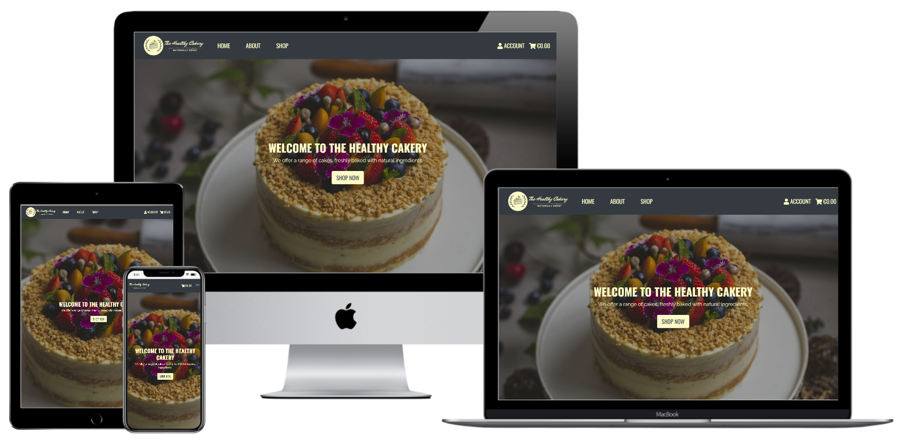

# [The Healthy Cakery](https://healthy-cakery.herokuapp.com/)

Milestone Project 4: Full-Stack Frameworks with Django - Code Institute

[The Healthy Cakery](https://healthy-cakery.herokuapp.com/) is an online Cake Shop where visitors will find a wide range of freshly baked cakes, prepared with organic, unrefined and locally sourced products.

## UX

My goal in the design was to create an elegant, responsive and user-friendly website, where potential customers and general visitors will find information about the products the Healthy Cakery offers.

The website consists of five main sections: Home, About, Shop, Account and Shopping Cart; where the users can easily navigate, find and purchase the product of their preference.

As the owner of the site, my goal was to sell the Healthy Cakery's products, promoting a healthier lifestyle, highlighting the fact that all the ingredients used to prepare the cakes are natural and 100% organic.

### User Stories

As a customer, I would like to:

- View a catalogue of all cakes available.
- See a specific category of cakes.
- See the details of a particular cake.
- See the purchase total cost at all times.
- Sort the catalogue of all cakes available.
- Sort within a specific category of cakes.
- Search for a cake by name or description.
- See the results of my search.
- Select the quantity of the cake to purchase.
- View the cake(s) in the shopping cart.
- Adjust the quantity or remove cakes from the shopping cart.
- Enter my contact details, delivery address and payment information.
- View my order confirmation after completing the checkout.
- Receive an email with the order confirmation after completing the checkout.
- Register for an account.
- Sign In / Sign Out.
- Recover my password.
- Edit my account details.

As the site's owner, I would like to:

- Add a new cake to the catalogue.
- Edit/Update cake details.
- Remove a cake from the catalogue.

### Design (Mockups)

The design of the application was represented with Mockups. Click [here](https://github.com/fredveloper/milestone-project-4/tree/static/images/mockups) to see the mockups.

## Features

### Existing Features
- DOM creation.
- User authentication.
- Login required for admin tasks.
- Shopping cart: add product, update quantity, remove a product.
- Checkout: payment authentication.
- Admin: product management.

### Features Left to Implement

Another feature ideas:

- Expand the user authentication functionality: login with social accounts.
- Add "Contact Us" section, for the customers to get in touch with the company by email in relation to a query or leave their feedback.

## Technologies Used

The project uses:

- HTML5
- CSS3
- [Bootstrap4](https://getbootstrap.com/): as a framework to create a responsive design, to style and structure all the pages of the website.
- [GoogleFonts](https://fonts.google.com/): as the library for the font families selected.
- [FontAwesome](https://fontawesome.com/): as icon library to style different components of the website.
- [JQuery](https://jquery.com): to simplify DOM manipulation.
- [JavaScript](https://www.javascript.com/): for interactive elements on pages.
- [Python3](https://www.python.org/): as main programming language.
- [Stripe](https://stripe.com/en-ie): as payment infrastructure.
- [Pillow](https://pillow.readthedocs.io/en/stable/): as Python imaging library.

- [GitHub](https://github.com/): For version control and backup of the code.
- [AWS](https://aws.amazon.com/): to host the images and static files including CSS and Javascript.
- [Heroku](https://www.heroku.com/): As a platform for app deployment.

## Testing

### Manual Test

The website was manually tested using different web browsers: Google Chrome, Firefox, Microsoft Edge and Internet Explorer. Its design is fully responsive to different screen sizes. 

The navigation bar elements display correctly and all the links redirect to the correct locations.

The search box works correctly and displays the results according to the user's search.

The sorting box displays the products according to the user's selection.

The forms are fully functional and the input elements display correctly. The forms are processed when all the required fields are filled in. 

All the buttons respond according to the option selected.

All the images display correctly.

### Code Validation

All the HTML and CSS files were inspected using the below validators:

- [W3C HTML Validator](https://validator.w3.org/) for the HTML files.
- [W3C CSS Validator](https://jigsaw.w3.org/css-validator/) for the CSS files.

## Deployment

- Live Demo: [The Healthy Cakery](https://healthy-cakery.herokuapp.com/)

- GitHub Repository: [Milestone Project 4](https://github.com/fredveloper/milestone-project-4)

### Remote Deployment

This application was fully deployed to Heroku, by following the below steps:

1. Run the command `pip3 freeze —local > requirements.txt` to create a requirements.txt file that contains all the packages required for this project.

2. Create a Procfile by running the command `echo web: python app.py > Procfile`.

3. Run `git add .` to stage all the files, run the command `git commit -m "<message>"` to commit the changes and finally push the files to the GitHub repository by using the command `git push origin master`.

4. Access Heroku and create a new app from the dashboard.

5. Go to new app 'Settings' section, and click on 'Reveal Config Vars' to set the following key-values:

| KEY | VALUE |
|:-:|:-:|
| SECRET_KEY | <your_secret_key> |
| STRIPE_PUBLIC_KEY | <your_stripe_public_key> |
| STRIPE_SECRET_KEY | <your_stripe_secret_key> |
| STRIPE_WH_SECRET | <your_stripe_wh_secret_key> |
| USE_AWS | True |
| AWS_ACCESS_KEY_ID | <your_aws_access_key_id> |
| AWS_SECRET_ACCESS_KEY | <your_aws_secret_access_key> |
| DATABASE_URL| <your_database_url_key> |
| EMAIL_HOST_PASS | <your_email_host_password> |
| EMAIL_HOST_USER | <your_email_host_user> |

6. Go to the 'Deploy' section to see the required steps to deploy the project to Heroku.

7. Push the code to GitHub and Heroku

8. The app will be finally hosted at: `http://<your_app_name>.herokuapp.com/`

### Local Deployment

The application can be deployed locally, by following the below steps:

Requirements:
- IDE (Visual Studio, PyCharm, etc).
- PIP, Git, Python and Django installed.

1. Download the application repository by clicking on 'Clone or Download' button located at the top of this page. Click on ‘Download ZIP’ and extract the files in a folder.

2. Within the IDE, open the folder that contains the repository.

3. Create a .env file containing the following credentials

os.environ["SECRET_KEY"] = "SECRET_KEY"

os.environ["STRIPE_PUBLIC_KEY"] = "STRIPE_PUBLIC_KEY"

os.environ["STRIPE_SECRET_KEY"] = "STRIPE_SECRET_KEY"

os.environ["STRIPE_WH_SECRET"] = "STRIPE_WH_SECRET"

os.environ["DATABASE_URL"] = "DATABASE_URL"

os.environ["AWS_ACCESS_KEY_ID"] = "AWS_ACCESS_KEY_ID"

os.environ["AWS_SECRET_ACCESS_KEY"] = "AWS_SECRET_ACCESS_KEY"

os.environ["EMAIL_HOST_PASS"] = "EMAIL_HOST_PASS"

os.environ["EMAIL_HOST_USER"] = "EMAIL_HOST_USER"

4. Install the required packages by running the command `pip -r requirements.txt`

5. Use the command `python app.py` to run the application and it will run at 'http://127.0.0.1:8080'.

## Credits
The business concept of my project was inspired by an existing food business called [Xocolat&More](https://www.xocolatandmore.com/), located in Colombia.

### Code

In this project, I implemented part of the code learnt of Code Institute's mini e-commerce project, but I refactored it to fulfill the functionality intended for the Healthy Cakery website.

### Content
- Some code implemented
- Some of the text in the "About" section was extracted from [CupCakeryNYC](http://www.cupcakerynyc.com/)
- Some of the cake descriptions were extracted from [Xocolat&More](https://www.xocolatandmore.com/) and translated into the English language.

### Media
- All the images were collected from [Unsplash](https://unsplash.com/) and [Canva](https://www.canva.com/).
- The logos were created by me in [Canva](https://www.canva.com/).

## Disclaimer
This project is for educational purposes only.
